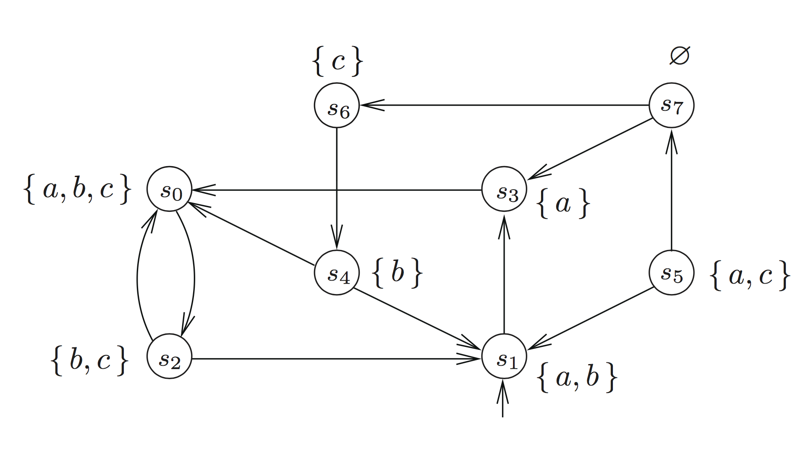
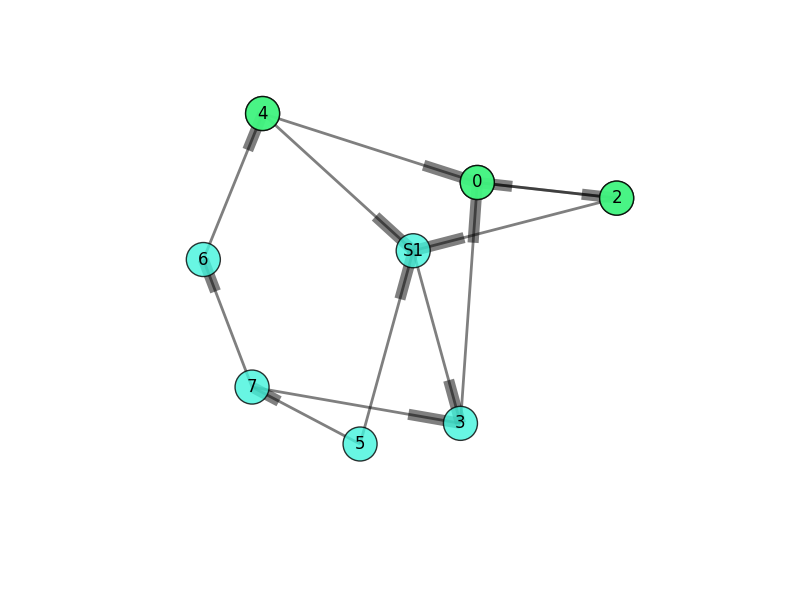

# CTLModelChecker
A simple model checking program for CTL developed for the course of Metodi Formali Per la Verifica di Sistemi.

run
```
cd src
./script.sh
```

The Transition System in the image below

is defined with XML file

```
<nodes>
	<node id="S1" label="a, b"/>
	<node id="0" label="a, b, c"/>
	<node id="2" label="b, c"/>
	<node id="3" label="a"/>
	<node id="4" label="b"/>
	<node id="5" label="a, c"/>
	<node id="6" label="c"/>
	<node id="7" label=""/>
</nodes>
<edges>
	<edge id="0" source="0" target="2"/>
	<edge id="1" source="S1" target="3"/>
	<edge id="2" source="2" target="S1"/>
	<edge id="3" source="2" target="0"/>
	<edge id="4" source="3" target="0"/>
	<edge id="5" source="4" target="0"/>
	<edge id="6" source="4" target="S1"/>
	<edge id="7" source="5" target="S1"/>
	<edge id="8" source="5" target="7"/>
	<edge id="9" source="6" target="4"/>
	<edge id="10" source="7" target="3"/>
	<edge id="11" source="7" target="6"/>
</edges>
```

In terminal you can run CTL properties like:
##### Exists Always b
with

```
python CTLModelChecker.py "[] b" PATH/FILE.XML
```
The output of CTLModelChecker can be used to create the visualization of the result as shown below.

